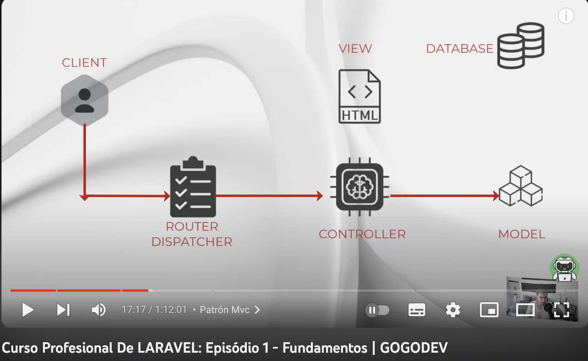

#  4 - Controladores
## Índice
1. [Introducción](#introducción)  
    1.1 Autoría
    1.2 Enlaces otros tutoriales
2. [Introducción](#Introduccion)
3. [Vinculación Ruta - Controlador - Vista](#Vinculación-Ruta-Controlador-Vista)
4. [Consultas A Modelos, Paso De Información Y Pintado](#Consultas-A-Modelos,-Paso-De-Información-Y-Pintado)
5. [Inserción De Datos](#Inserción-De-Datos)
6. [Eloquent](#Eloquent)
7. [Sql Raw](#Sql-Raw)
8. [Conclusiones](#conclusiones)  
9. [ESTRUCTURAS USADAS PARA CÓDIGO](#ESTRUCTURAS-USADAS-PARA-CÓDIGO) 

### Autoría:
Nombre Apellido

### Índice tutoriales compartido:
Enlace a documento otros enlaces: https://docs.google.com/spreadsheets/d/1TlTPsH7cqD5hOjx-rOBRUVRctjXe3eRFLp53xIHPYaU/edit#gid=1531092079

## Introducción
Vamos a analizar el tutorial:  
Curso Profesional De LARAVEL: ```4 - Controladores``````
Enlace tutorial: https://www.youtube.com/watch?v=YJrCBe4hx3Y



### Apartados/tiempos:
0:00:00 - Introducción
0:01:31 - Vinculación Ruta - Controlador - Vista
0:23:25 - Consultas A Modelos, Paso De Información Y Pintado
0:40:29 - Inserción De Datos
0:53:37 - Eloquent
1:11:01 - Sql Raw
1:24:52 - Conclusiones


## Introducción
## Vinculación Ruta - Controlador - Vista
## Consultas A Modelos, Paso De Información Y Pintado
## Inserción De Datos
## Eloquent
## Sql Raw
## Conclusiones

# ESTRUCTURAS USADAS PARA CÓDIGO:
* Dos espacios al final si queremos un nuevo párrafo:
* Cuando comentemos algún archivo, siempre es bueno indicar la ruta:    

Ruta: ```    ``` 

Para php:
```php 

``` 
Para comandos de terminal
```sh 

``` 
Para subrayar algo que quede resaltado igual que la ruta  
```  ejemplo  ```  
Subrayar en ***negrita***

Un artículo se vincula a otro en un subdirectorio del directorio actual:
[link text](directory/article-name.md)