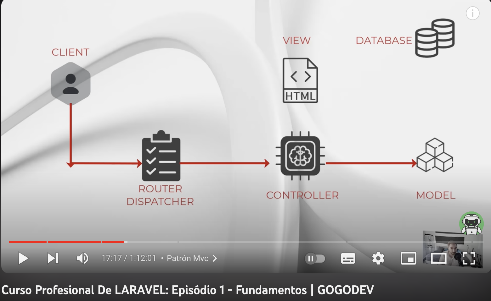

#  5 - CRUD, Validación y Sesión
## Índice
1. [Introducción](#introducción)  
    1.1 Autoría
    1.2 Enlaces otros tutoriales
2. [Introducción](#Introduccion)
 
8. [Conclusiones](#conclusiones)  
9. [ESTRUCTURAS USADAS PARA CÓDIGO](#ESTRUCTURAS-USADAS-PARA-CÓDIGO) 

### Autoría:
Nombre Apellido

### Índice tutoriales compartido:
Enlace a documento otros enlaces: https://docs.google.com/spreadsheets/d/1TlTPsH7cqD5hOjx-rOBRUVRctjXe3eRFLp53xIHPYaU/edit#gid=1531092079

## Introducción
Vamos a analizar el tutorial:  
Curso Profesional De LARAVEL: ```5 - CRUD, Validación y Sesión``````
Enlace tutorial: https://www.youtube.com/watch?v=T_9pKfj1dBI



### Apartados/tiempos:
0:00:00 - Introducción
0:00:40 - Rutas Con Parámetros
0:23:25 - Crud Parte I
0:33:52 - Crud Parte Ii
1:03:46 - Crud Parte Iii
1:31:25 - Validación Y Custom Request
1:46:21 - Gestión De Errores Y Mensajes De Sesión
2:03:52 - Rutas Y Controladores Resource
2:15:13 - Conclusiones


## Introducción
 
## Conclusiones

# ESTRUCTURAS USADAS PARA CÓDIGO:
* Dos espacios al final si queremos un nuevo párrafo:
* Cuando comentemos algún archivo, siempre es bueno indicar la ruta:    

Ruta: ```    ``` 

Para php:
```php 

``` 
Para comandos de terminal
```sh 

``` 
Para subrayar algo que quede resaltado igual que la ruta  
```  ejemplo  ```  
Subrayar en ***negrita***

Un artículo se vincula a otro en un subdirectorio del directorio actual:
[link text](directory/article-name.md)