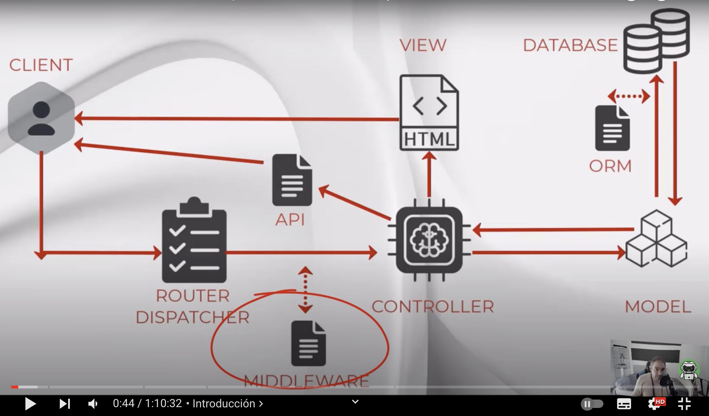
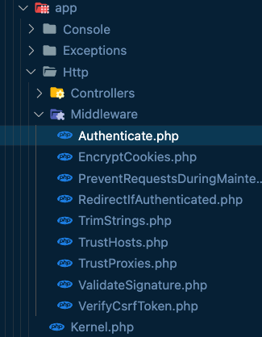
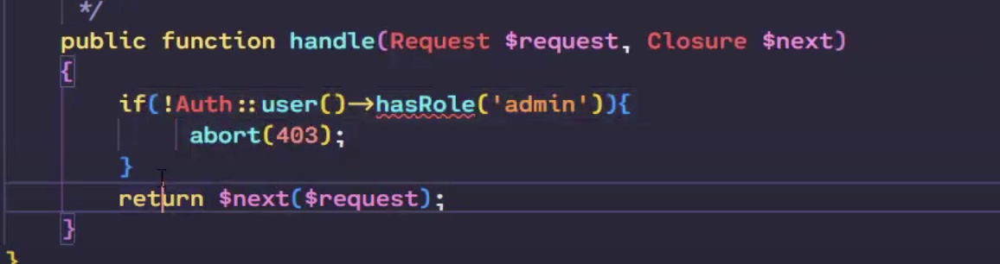
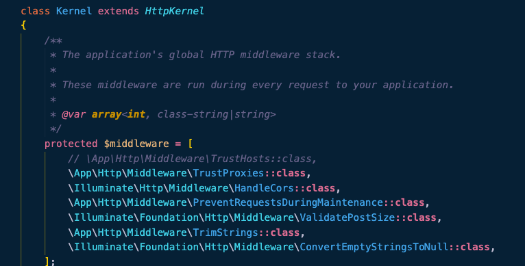
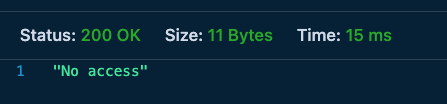
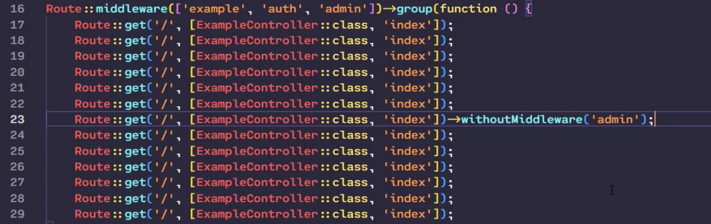

# 9 GOGODEV_AutenticacionAPI
## Índice
1. [Introducción](#introducción)  
    1.1 Autoría
    1.2 Enlaces otros tutoriales
2. [Instalación](#instalación)
3. [Crear Middleware]()
3.1 [Creación proyecto](#Creación-proyecto)
4. [Registrando Middleware en Kernel](#Registrando-Middleware-en-Kernel)
5. [Middleware en Rutas](#Middleware-en-Rutas)
6. [Middleware en Grupos de Rutas](#Middleware-en-Grupos-de-Rutas)
7. [Middleware en Construcciones](#Middleware-en-Construcciones)
8. [Api Auth Sanctum](#Api-Auth-Sanctum)
9. [CONCLUSIONES](#conclusiones)  
10. [ESTRUCTURAS USADAS PARA CÓDIGO](#ESTRUCTURAS-USADAS-PARA-CÓDIGO) 

### Autoría:
Antonio Jesús Marín Espejo- pamarin@iesfranciscodelosrios.es
### Índice tutoriales compartido:
Enlace a documento otros enlaces: 

## Introducción
Vamos a analizar el tutorial  
Curso Profesional De LARAVEL: Episodio 9 - Middleware y Autenticación API | GOGODEV  
para comprender y analizar estos dos aspectos tan importantes  
Enlace tutorial: https://www.youtube.com/watch?v=57jtVRxWEMw




Autenticación o rol en un servicio
Focos
* Middleware: Cómo es, cómo hacerlo, cómo afecta a cada sección, cómo marcarlo a diferentes rutas
* Autenticación API Sanctum: Parte fundamental, también se puede implementar en frontales. Pero empezar por aquí es más importante para poder usar en Front.
* Lo Crearemos a través de token


## Crear Middleware

1. Crear Proyecto
```sh 
composer create-project laravel/laravel middlewareauth
```

2. Configurar base de datos  
En lugar de conectar a mysql como hace él, lo haremos con SQLITE:  
```fichero: .env```

```sh 
Cambiamos la conexión mysql por
DB_CONNECTION=sqlite
```

3. ¿Dónde están?  
Por defecto están en ```app/Http/Middleware```

Y nos ofrece ya cargados:  


4. Crear un middleware
```sh 
php artisan make:middleware Example
```
INFO  Middleware [app/Http/Middleware/Example.php] created successfully. 

* No existe convención para el nombre
* Observamos el contenido de la nueva clase, siempre hay un HANDLE
* Como medio de protección, se encarga de gestionar la acción de protección o adición sobre la ruta
Por ello, antes de que se ejecute el controlador, se ejecutará el Middleware
* Next indica el siguente valor del flujo, a donde corresponda
* Dentro de la lógica, si no cumple, el next lo redigirimos a otra ruta (cómo con la autenticación que lo bloqueamos)

Un ejemplo, podría ser (este método NO existe, no se crea):  


)

Ya sabemos crearlo, y retornar el flujo

Ahora, nuestro controlador Example debe estar registrado en nuestro contenido para poder llamarlo.
Es lo que haremos en la siguiente sección

## Registrando Middleware en Kernel

Ruta: ```app/http/Kernel.php```  
Aquí es donde vamos a marcar todos los recursos compartidos
La clase contiene 3 arrays que son middleware, los grupos (web y api) y los alias (auth)



 Aquí se definen los que podramos utilizar. Y donde pueden ser usados.
 1. Grupo GLOBAL, aplican a todo, si está protegida o no...  
 Por ejemplo seguridad, validación, prevención...
 Se ejecutan siempre

 2. MiddlwareGroups  
 Aplican siempre dentro de las diferentes partes, subconjunto que aplica solo a WEB y otro para API

 3. middlewareAliases (antes era routeMiddleware  )
 Pares de clave valor con el nombre y la clase que lo respalda.
 * Ahora si se le da nombre porque a los otros no hacía falta ya que se aplicaban siempre
 * Aquí vamos a definir ahora nuestro example:

 ```php
 'example' => \App\Http\Middleware\Example::class,
 ``` 


## Middleware en Rutas
Lo invocamos a través de example, pero ¿Cómo protegemos la ruta?  
* Lo normal es protegerla explicitamente, directamente en la ruta. La más sencilla:
ruta: ```routes/api.php```   

Ya hemos visto algun ejemplo como el que carga por defecto:  
```php
Route::middleware('auth:sanctum')->get('/user', function (Request $request) {
    return $request->user();
});
```

Antes de añadir la ruta a la API vamos a crear el controlador de example, que no lo hemos creado
```sh
php artisan make:controller ExampleController
```

Le añadimos la función de ejemplo a la clase ExampleController:
```php
//Añadimos función de ejemplo:
    public function index(){
        return response()->json("Hello World", 200);
    }
``` 

Importante agregarlo en ``api.php```  

```php
use App\Http\Controllers\ExampleController;
```  


Ahora mismo estamos aprendiendo el middleware de forma general, nos vale para las vistas como para el monolito.

* Volvemos a la ruta api y la creamos
Esta sería la ruta básica sin protección para la raiz:
```php
 Route::get('/', [ExampleController::class, 'index']);
``` 
 Ahora le pasamos el valor example que registramos antes al middleware para proteger la ruta, y ejecutarlo antes de la ruta

```php
 Route::middleware('example')->get('/', [ExampleController::class, 'index']);
``` 

Para notar la diferencia creamos otra ruta:

```php
//Le damos también un nombre de ruta con el método name
Route::get('/no-access', [ExampleController::class, 'no-access'])->name('no-access');
``` 


```php
 //Añadimos una segunda función de ejemplo para observar la diferencia:
   public function noAccess(){
    return response()->json("No access", 200);
    }
``` 

Una vez hecho esto, nosotros en la clase del Middleware Example podríamos hacer la construcción que necesitamos. Por ejemplo:

ruta: ```app/http/Example.php```
* Vamos a redirigir siempre a la nueva ruta de ejemplo (podemos comentar next ya que no se ejecutará)

```php
 return redirect()->route('no-access');
        //return $next($request);
``` 

Antes de nada migramos todo el contenido

```sh
 php artisan migrate
``` 

* O a través del constructor del controlador

Levantamos el servicio
```sh
 php artisan serve
``` 

Y podemos realizar nuestras peticiones en thunder Client   
La primera va a ser api al raiz, que dará NO ACCESS:

```sh 
``` 



```sh 
http://127.0.0.1:8000/api/
``` 

Si descomentáramos en el middleware Example.php y dejáramos el original si que dejaría pasar y daría OK HelloWorld
  
```php
 //return redirect()->route('no-access');
        return $next($request);
``` 

Así, en estas clases Middleware podríamos aplicar toda la protección, podríamos hacer Grupos de Rutas, que es lo que vemos en el siguiente bloque

## Middleware en Grupos de Rutas

Así no tenemos que repetir las llamadas en las rutas
en ```api.php``````

Group recibe una función con todas las rutas que se contienen dentro de este grupo.

```php 
Route::middleware('example')->group(function(){
    //Cambiamos la ruta axample aquí dentro de este grupo:
    Route::middleware('example')->get('/', [ExampleController::class, 'index']);
});
```


* Podemos aplicarle más de un middleware a un grupo añadiéndolo tras la coma:
```php
Route::middleware('example', 'example2', ...)...
``` 
* Además dentro de un grupo podemos quitarle un middleware a alguna ruta (ejemplo admin):


 

 Ya sabemos aplicar middleware de forma singular y en grupo, el tercer formato sólo es válido en una buena estructuración de controladores, siguiente apartado:


## Middleware en Construcciones
ruta: ``` routes/api.php   ``` 
Para probar esta técnica, lo primero, dejamos las dos rutas sin el middleware, las comentamos:

```php 
Route::get('/', [ExampleController::class, 'index']);
/*
Route::middleware('example')->group(function(){
    //Cambiamos la ruta axample aquí dentro de este grupo:
    Route::middleware('example')->get('/', [ExampleController::class, 'index']);
});
*/
``` 
Y nos vamos al controlador para crearlo, ruta: ``` app/Http/Controllers/ExampleController.php   ``` 
```php 
//añadiendo el middleware en el constructor:
    public function __construct(){
        //le indico que quiero utilizar el middleware
        this->middleware('example');
    }
``` 

Hace mucho hincapié en tener muy claro la buena estructuración de los controladores para usar esto:
*  min 37 explica un error circular de too many request si lo añades en controlador y el middleware le redirige a NO ACCESS..

* Casos prácticos clásicos: administración de panel de usuario o autenticación
* Ante la duda: hacerlo en la ruta
* Ahora entendemos el concepto, podemos ya empezar a usarlo y entender bien las autenticaciones, que son la base para poder construir más bloques middleware


## Api Auth Sanctum
minuto 39  https://youtu.be/57jtVRxWEMw?t=2341

Vamos a realizar el primer sistema de autenticación a través de API.
token al portador, bearer tokens. 

1. Usuario facilita email y password desde el frontal VUE, JS, REACT...
2. Generamos token y se lo devolvemos al front
3. Ahora cada vez que quiera pedirnos información ha de enviarnos ese token para que back verifique

* Laravel ya nos incluye autenticación con la librería SANCTUM

¿Cómo funciona?
Creamos controlador que permita crear y loguear usuarios, ya tenemos modelo de usuarios ***USER***
```sh 
php artisan make:controller AuthController
``` 
```    INFO  Controller [app/Http/Controllers/AuthController.php] created successfully.    ``` 

Ruta: ```  app/Http/Controllers/AuthController.php  ``` 

* Aquí creamos algunas funciones para registrar a nuestros usuarios
* Necesitamos crear primero una request para validar usuarios
```sh 
php artisan make:request CreateUserRequest
```
```
 INFO  Request [app/Http/Requests/CreateUserRequest.php] created successfully. 
```
Va a ser una request muy sencilla. En el authorize() cambiamos a true

```php 
 public function authorize(): bool
    {
        return true;
    }
``` 
Y en reglas:

```php 
   public function rules(): array
    {
        return [
            //En las reglas, solicitamos los datos necesarios:
            'name' => 'required',
            //el email ha de ser único dentro de la tabla usuarios en el campo email
            'email' => 'required|email|unique:users, email',
            'password' => 'required', //podriamos indicar longitud minuma...
            
        ];
    }
``` 

* Ahora si en el authController, añadimos las librerias
```php 
use App\Http\Request\CreateUserRequest;
use App\Http\Request\LoginRequest;
use Illuminate\Http\Request;
use Illuminate\Support\Facades\Hash;
use App\Model\User;
use Auth;
``` 
* Configuramos las funciones de la clase AuthController

```php 
public function createUser(CreateUserRequest $request){
        //1º validación de los datos, lo hacemos a través de una request que creamos primero
        //Si el sistema llega hasta aquí es porque nos han enviado unos datos válidos
        $user = User::create([
            'name' => $request->name,
            'email' => $request->email,
            //vamos a encriptar el password ya que es info sensible
            'password' => Hash::make($request->password)
        ]);
         //respondemos que el usuario ha sido creado
        return response()->json([
            'status' => true, 
            'message' => 'User create successfully',
            //tenemos que generar el token de seguridad y mandárselo:
            'token' => $user->createToken("API TOKEN")->plainTextToken
        ], 200);

    }
``` 

Tras el create, definimos ahora el loginUser:  
De nuevo, volvemos a necesitar un loginRequest, lo creamos:


```sh 
php artisan  make:request LoginRequest
``` 
 ``` INFO  Request [app/Http/Requests/LoginRequest.php] created successfully.     ```
   
Cambiamos el authorise a true y pedimos:
```php 
    public function rules(): array
    {
        return [
            'email' => 'required|email',
            'password' => 'required',  
        ];
    }
``` 
  
  Ahora generamos las validaciones, Laravel nos ofrece una clase ***muy muy útil*** que es la clase  ***``` Auth```***
  Podemos:
   //1 acceder a los datos del usuario logueado
   //attempt, tratar de loguear a un usuario

```php 
public function loginUser(LoginRequest $request){
        
        //AUTH clase muy útil que nos permite
        //1 acceder a los datos del usuario logueado con  Auth::user()->email;...
        
        //2. attempt, tratar de loguear a un usuario
        // Lo hacemos SOLO con el email y el pass, si falla:
        if(!Auth::attempt($request->only(['email', 'password']))){
            return response()->json([
                'status'=>false,
                'message'=> 'Email & password dont match with our records'
            ], 401); // error fallo de autencicación
        }
        //Ahora si la autenticación sabemos que ha sido correcta, lo podemos autenticar:
        //buscamos y almacenamos los datos de usuario:
        $user = User::where('email', $request->email)->first();

        return response()->json([
            'status'=>true,
            'message'=> 'User logged in successfully',
            //Se acaba de generar, generamos el token y se lo damos:
            'token' => $user->createToken("API TOKEN")->plainTextToken
        ],200);

    }
``` 
Ya hemos finalizado la creación de nuestro authController

* Con todo ello, el archivo AuthController.php quedaría así:
[AuthController.php](middlewareauth/app/Http/Controllers/AuthController.php)


Ya que tenemos nuestro controlador, necesitamos especificarlo en nuestras rutas

### Configuración de las rutas:
Ruta: ```  api.php  ``` 

Eliminamos las que creamos previamente (las comento)
```php 
//Route::get('/no-access', [ExampleController::class, 'noAccess'])->name('no-access');
//Route::get('/', [ExampleController::class, 'index']);
``` 
Y generamos nuevas rutas:
```php 
Route::post('/create', [AuthController::class, 'createUser']);
Route::post('/login', [AuthController::class, 'loginUser']);

//ruta para obtener un dato protegido, aprovechamos la de laravel.
Route::middleware('auth:sanctum')->get('/user', function (Request $request) {
    return $request->user();
});
``` 

Una vez redefinida nuestra API, vamos a probarla:
### Probando la API:
Levantamos el servicio:
```sh 
php artisan serve
``` 
Nueva petición en thunderclient:


## CONCLUSIONES

# ESTRUCTURAS USADAS PARA CÓDIGO:
* Dos espacios al final si queremos un nuevo párrafo:
* Cuando comentemos algún archivo, siempre es bueno indicar la ruta:    

Ruta: ```    ``` 

Para php:
```php 

``` 
Para comandos de terminal
```sh 

``` 
Para subrayar algo que quede resaltado igual que la ruta  
```  ejemplo  ```  
Subrayar en ***negrita***

Un artículo se vincula a otro en un subdirectorio del directorio actual:
[link text](directory/article-name.md)