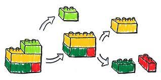

#  Tutoriales GOGODEV 
## Índice
1. [Introducción](#introducción)  
    1.1 Autoría
    1.2 Enlaces otros tutoriales
2. [Imágenes](#imagenes)
4. [ESTRUCTURAS USADAS PARA CÓDIGO](#ESTRUCTURAS-USADAS-PARA-CÓDIGO) 

### Autoría:
Antonio Jesús Marín Espejo- pamarin@iesfranciscodelosrios.es
### Índice tutoriales compartido:
Enlace a documento otros enlaces: https://docs.google.com/spreadsheets/d/1TlTPsH7cqD5hOjx-rOBRUVRctjXe3eRFLp53xIHPYaU/edit#gid=1531092079  
Todos los tutoriales que puedan aportar se pueden añadir a dicho documento mediante comentarios.  


## Introducción

Vamos a ver una serie de videos dentro del Curso Profesional Laravel GOGODEV
* Trabajaremos en equipo, repartiendo tutoriales y compartiendo código.
* Realizaremos este curso completo en lugar de diferentes cursos y Bootcamps por NO repetir partes, para ser más eficientes y por sus buenos comentarios

* Hay que tener en cuenta que el curso se crea con la versión 9 de Laravel, algunos elementos cambian con las nuevas versiones o si lo preferimos podemos crear nuestros proyectos con la versión 9 para mayor compatibilidad con los tutoriales.

* Hay que documentar todo lo que aparece en el video de forma completa, sobretodo los puntos que sustentan una base teórica de conceptos y herramientas.

* Se puede tomar como referencia el documento README.md del ```capítulo 9``` que está completo  
Curso Profesional De LARAVEL: Episodio 9 - Middleware y Autenticación API | GOGODEV  

* El índice de cada readme debe coincidir con la estructura creada en el videotutorial, incluyendo siempre las ***conclusiones***

* Al final de este documento tenéis una breve referencia para crear estos arhivos readme, con los bloques más usados como PHP y SH, pero hay mucha más información en Internet.

 


## Imágenes

Para documentar el readme, hay que almacenar las capturas en la carpeta ***image*** del primer nivel, dentro de esa carpeta se creará el proyecto Laravel y el archivo ***```readme.md```*** documentado por nosotros


# ESTRUCTURAS USADAS PARA CÓDIGO:
* Dos espacios al final si queremos un nuevo párrafo:
* Cuando comentemos algún archivo, siempre es bueno indicar la ruta:    

Ruta: ```    ``` 

Para php:
```php 

``` 
Para comandos de terminal
```sh 

``` 
Para subrayar algo que quede resaltado igual que la ruta  
```  ejemplo  ```  
Subrayar en ***negrita***

Un artículo se vincula a otro en un subdirectorio del directorio actual:
[link text](directory/article-name.md)